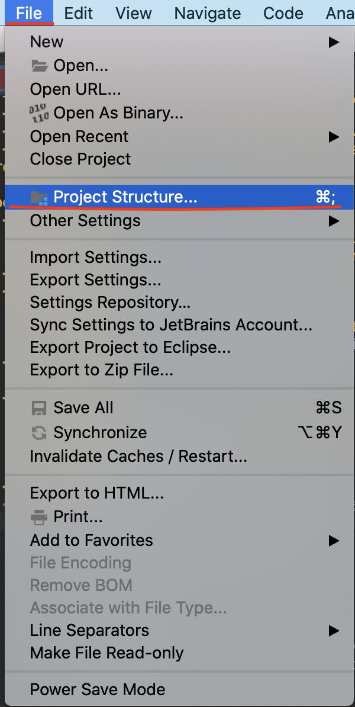
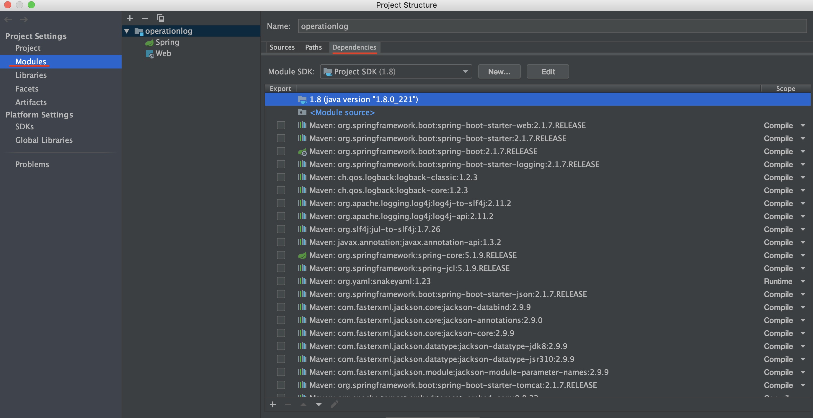
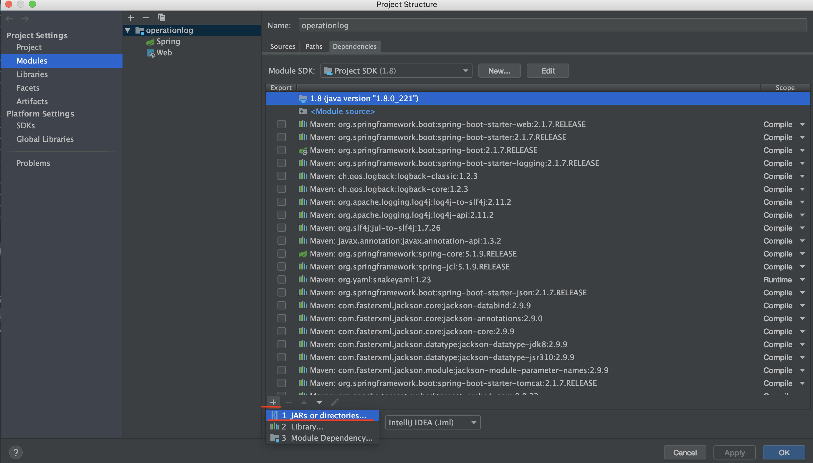
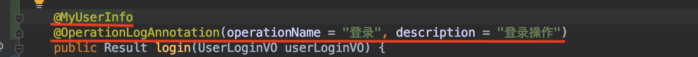
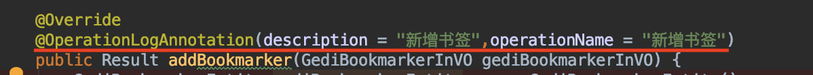

## 操作日志模块

该模块的作用是作为一个公共的应用系统日志操作模块，使用Spring AOP思想，采用注解的方式注入使用。

### 涉及到的技术

主要采用spring boot+mybaitsplus

## 如何使用

### 1、导入该操作日志模块的jar包

1-1.打开 File -> Project Structure （Ctrl + Shift + Alt + S）


1-2.单击 Modules -> Dependencies -> "+" -> "Jars or directories"




1-3.选择硬盘上的jar包
1-4.Apply -> OK

#### 2、pom文件导入一下依赖包

```
 <properties>
        <java.version>1.8</java.version>
        <mybatis.plus.generator.version>3.0.7.1</mybatis.plus.generator.version>
        <lombok.version>1.16.20</lombok.version>
        <commons-lang3.version>3.4</commons-lang3.version>
        <mybatis.plus.version>3.0.7.1</mybatis.plus.version>
    </properties>

    <dependencies>
        <dependency>
            <groupId>org.springframework.boot</groupId>
            <artifactId>spring-boot-starter-web</artifactId>
        </dependency>
        <dependency>
            <groupId>com.baomidou</groupId>
            <artifactId>mybatis-plus-generator</artifactId>
            <version>${mybatis.plus.generator.version}</version>
        </dependency>

        <dependency>
            <groupId>org.projectlombok</groupId>
            <artifactId>lombok</artifactId>
            <version>${lombok.version}</version>
            <scope>provided</scope>
        </dependency>
        <!-- https://mvnrepository.com/artifact/oracle/oracle-jdbc 导入的数据库驱动，以具体项目为主，这里以oracle为例子-->
<!--        <dependency>-->
<!--            <groupId>com.oracle</groupId>-->
<!--            <artifactId>ojdbc6</artifactId>-->
<!--            <version>11.2.0.3</version>-->
<!--        </dependency>-->

<!--        <dependency>-->
<!--            <groupId>org.springframework.boot</groupId>-->
<!--            <artifactId>spring-boot-starter-jdbc</artifactId>-->
<!--        </dependency>-->

        <dependency>
            <groupId>org.apache.commons</groupId>
            <artifactId>commons-io</artifactId>
            <version>1.3.2</version>
        </dependency>
        <dependency>
            <groupId>com.baomidou</groupId>
            <artifactId>mybatis-plus-boot-starter</artifactId>
            <version>${mybatis.plus.version}</version>
        </dependency>
        <dependency>
            <groupId>org.apache.commons</groupId>
            <artifactId>commons-lang3</artifactId>
            <version>3.9</version>
        </dependency>


        <dependency>
            <groupId>org.aspectj</groupId>
            <artifactId>aspectjweaver</artifactId>
            <version>1.9.5</version>
        </dependency>
        <dependency>
            <groupId>commons-collections</groupId>
            <artifactId>commons-collections</artifactId>
            <version>3.2.2</version>
        </dependency>


    </dependencies>
```

#### 3、相关配置的设置

3-1添加mapper包的配置，扫描mapper文件

spring boot 启动类添加@MapperScan("**gedi.log.mapper**")配置，且**gedi.log.mapper**是固定的，不可修改。

3-2 在application.properties文件或application.yml文件添加一下配置

application.properties 添加

```properties
login.username=username
```

application.yml

```yml
login:
  username: username
```

这一步的目的是方便**@MyUserInfo**获取根据配置文件的用户名的值，保存到session中，为之后的**@OperationLogAspect**作准备。

#### 4、通过使用注解来保存操作日志

主要使用的注解有两个**@MyUserInfo**和**@OperationLogAspect**，也是该模块的主要内容。

4-1 如何使用

**登录接口使用**



此接口为登录的接口，**@MyUserInfo**获取根据配置文件的用户名的值，保存到session中，此注解在登录接口必需添加。**@OperationLogAspect**，有两个参数，operationName为操作名称，description则是具体的描述，这两个参数为非必填，不过，为了后续系统维护，强烈建议使用。

**非登录接口使用**




##### 使用说明到此结束！！！！